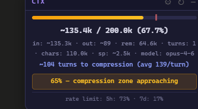

# Claude Context Monitor

A Chrome extension that monitors context window usage on [claude.ai](https://claude.ai) in real time.

Claude.ai doesn't show how much of the context window you've used. This extension estimates it and warns you before automatic compression kicks in.

## Features

- **Context usage bar** — estimates tokens used vs. 200k limit, updated live as you chat
- **Compression warning** — 4-level alerts at 50% / 65% / 75% / 85% usage
- **Turns-to-compression estimate** — tells you roughly how many more turns before compression
- **Compression detection** — alerts when context is actually compressed (DOM text drops significantly)
- **Rate limit display** — shows your 5-hour and 7-day rate limit utilization
- **System prompt offset** — accounts for hidden system prompt tokens (configurable via ⚙)
- **Conversation switch detection** — auto-resets when you switch conversations
- **Draggable widget** — position is remembered across page reloads

## How it works

Claude.ai's API does not expose token counts to the frontend. This extension:

1. **Intercepts SSE streaming responses** to capture model name, rate limit data, and output text
2. **Reads conversation text from the DOM** using `textContent` (bypasses `content-visibility: auto`)
3. **Estimates tokens** with a CJK-aware heuristic (~1.5 tokens/char for CJK, ~0.25 for Latin)

All numbers are estimates (marked with `~`). They're directionally accurate but not exact.

## Install

### From GitHub (manual)

1. **Download** this repo:
   - Click the green **Code** button → **Download ZIP**, then unzip
   - Or: `git clone https://github.com/lethaquinn/-claude-context-monitor.git`

2. **Load in Chrome:**
   - Go to `chrome://extensions/`
   - Enable **Developer mode** (top right toggle)
   - Click **Load unpacked**
   - Select the `claude-context-monitor` folder

3. **Open [claude.ai](https://claude.ai)** — the widget appears in the bottom-right corner.

### Updating

Pull the latest changes (or re-download the ZIP), then click the reload button (↻) on `chrome://extensions/`.

## Widget guide

| Element | Meaning |
|---------|---------|
| Progress bar | Context usage %. Purple → Yellow (50%) → Orange (75%) → Red (85%) |
| Red tick on bar | Estimated compression zone (~75%) |
| `~135.4k / 200.0k (67.7%)` | Estimated tokens used / limit |
| `in: ~135.3k` | Input tokens (conversation history + system prompt) |
| `out: ~89` | Output tokens (current session's responses) |
| `sp: ~2.5k` | System prompt offset (hidden tokens) |
| `~104 turns to compression` | Estimated turns remaining before compression triggers |
| `rate limit: 5h: 73%` | Rate limit utilization from claude.ai |
| ⚙ | Settings — adjust system prompt offset |
| ↻ | Manual refresh |
| — / + | Collapse / expand widget |

## Settings

Click ⚙ to adjust:

- **System prompt offset** — claude.ai injects a hidden system prompt (~2500 tokens by default). If you use Projects with long custom instructions, increase this value. Saved in localStorage.

## Limitations

- Token counts are **estimates**, not exact. The heuristic works well for mixed CJK/English text but may be off for code-heavy conversations.
- Compression threshold (~75%) is an educated guess — Anthropic hasn't published the exact trigger point.
- The extension can only track output tokens from messages sent **after** the extension loaded. Pre-existing conversation output is included in the DOM-based input estimate.
- Mobile / Claude app: not supported (native apps can't run browser extensions).

## Privacy

- All processing happens **locally in your browser**. No data is sent anywhere.
- The extension only activates on `claude.ai`.
- Source code is fully readable — it's 3 files of vanilla JavaScript.

## Tech

- Chrome Extension Manifest V3
- Vanilla JS, no dependencies
- `inject.js` — patches `fetch` in page context to intercept SSE streams
- `content.js` — manages widget UI, token estimation, alert logic
- `styles.css` — dark theme, monospace, purple accent

## License

MIT

## Credits

Built by [S](https://github.com/lethaquinn) and [沉映 (Claude Velorien)](https://claude.ai).
